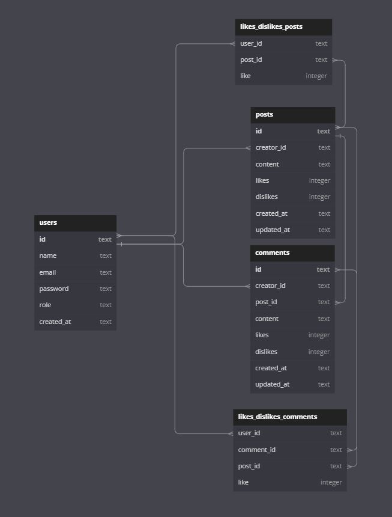

# Labeddit Back-end

## 📑 Introdução

    O projero Labeddit é uma rede social desenvolvida com o intuito de conectar diferentes pessoas e fazer com que elas possam interagir entre si. Desta forma o Labeddit permite a criação de usuários, criação de posts e comentários, além de poder curtir/descurtir posts e comentários de outras pessoas.

## 🖋 Diagrama Banco de Dados

## ⚙️Tecnologias utilizadas

1. ``NodeJS``
2. ``Typescript``
3. ``Express``
4. ``SQL e SQLite``
5. ``Knex``
6. ``Postman``
7. ``POO``
8. ``Arquitetura em camadas``
9. ``Geração de UUID``
10. ``Geração de hashes``
11. ``Autenticação e autorização``
12. ``Roteamento``
13. ``Jest``

## 📱 Funcionabilidades do Projeto

- [x] Endpoints:

- signup;
- login;
- create post;
- get posts;
- edit post;
- delete post;
- like / dislike post;
- create comment;
- get comment;
- delete comment;
- like / dislike comment;
 

- [x] Autenticação e autorização:

-  identificação UUID;
- senhas hasheadas com Bcrypt;
- tokens JWT;
 

- [x] Código:

- POO;
- Arquitetura em camadas;
- Roteadores no Express.
 

## 📌 Aplicações utilizadas
- Postman
- Render

## 💻 Repositório Front-end
- gitHub: https://github.com/BarbaraAmaral27/labeddit-frontend

## 📝 Documentação
- Postman: https://documenter.getpostman.com/view/18780309/2s93RMTuK1

## 💿 Rodando o Projeto
- Rode o console na pasta em que você baixou os arquivos;

- Insira o comando npm install;

- Depois, o comando npm run dev para rodar no navegador.
